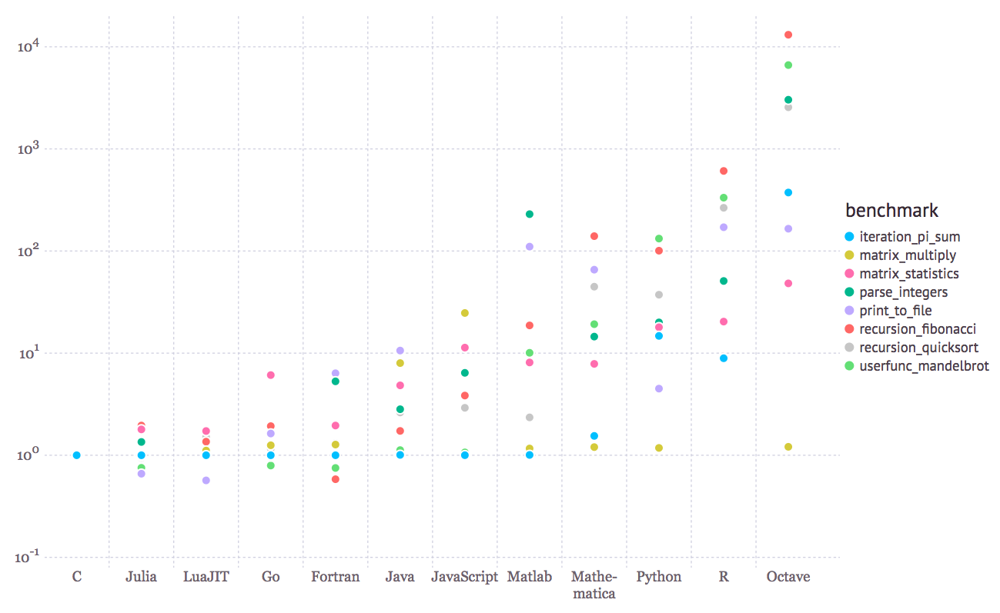

<link rel="icon"  type="image/png"    href="https://www.intersect.org.au/docs/logo_intersect.gif">

# Introduction

Welcome to Intersect's Introduction to Programming with Julia course.

### Why Julia

Julia is a high-level, high-performance dynamic programming language. Note that there is also IJulia, a collaboration between the Jupyter and Julia communities, which provides a powerful browser-based graphical notebook interface to Julia. The Julia developer community is contributing a number of external packages through Julia’s built-in package manager at a rapid pace (more than 1700 available libraries for Julia). The core of the Julia implementation is licensed under the MIT license. 

### Performance

Julia’s compiler and design make it feasible to approach and often match the performance of the programming language C. Please see the image below to get a sense of the performance of Julia compared to a variety of programming languages, such as C, Python, R, Fortran, Matlab/Octave, JavaScript, Java, Lua, and Mathematica, that can or could be used for scientific analysis.

*The picture was reproduced from [https://julialang.org/](https://julialang.org/)

### Flexibility

Julia allows you to range from tight low-level loops and conditionals, up to a high-level programming style. It may sacrifice some performance, but gain the ability to express complex algorithms easily. This continuous spectrum of programming levels is a hallmark of the Julia approach to programming and is very much an intentional feature of the Julia programming language. 

Furthermore, Julia can be built as a shared library, therefore users can combine Julia with their own C or Fortran code or proprietary third-party libraries. In Julia, it is also simple to call external functions in C and Fortran shared libraries, directly from Julia’s interactive prompt, without writing any wrapper code or even recompiling existing code. 

### Parallelisation

Julia does not impose any particular style of parallelism on the user. Instead, it provides a number of key building blocks for distributed computation, making it flexible enough to support a number of styles of parallelism, and allowing users to add more.

# Prerequisites

This course does not require any prior knowledge in programming. If you would like to explore other programming languages, please consider our training courses: [Introduction to Programming with R, Introduction to Programming with Python and Introduction to Programming with Matlab.](https://intersect.org.au/energy/training)

# Outline

|Module number|&nbsp;&nbsp;&nbsp;&nbsp;Name|&nbsp;&nbsp;&nbsp;&nbsp;Learning Objectives|
|:---: |:--- |:--- |
| | | |
|0|&nbsp;&nbsp;&nbsp;&nbsp;[Setup]({{ site.baseurl }}/modules/00-setup)|&nbsp;&nbsp;&nbsp;&nbsp;Setup for this course and how to setup Julia environment on your local machine|
| | | |
|1|&nbsp;&nbsp;&nbsp;&nbsp;[Getting Started with Julia]({{ site.baseurl }}/modules/01-Getting-started-with-julia)|&nbsp;&nbsp;&nbsp;&nbsp;An introduction to basic elements of programming, such as variable types, data structures and useful built-in functions|
| | | |
|2|&nbsp;&nbsp;&nbsp;&nbsp;[Selecting Elements from an Array]({{ site.baseurl }}/modules/02-slicing)|&nbsp;&nbsp;&nbsp;&nbsp;Learn how to import packages (libraries) in Julia, how to load csv files, how to slice and select specific elements from an array, how to perform basic operations and stas using arrays, and how to start using plots.|
| | | |
|3|&nbsp;&nbsp;&nbsp;&nbsp;[Repeating Actions with Loops]({{ site.baseurl }}/modules/03-loops)|&nbsp;&nbsp;&nbsp;&nbsp;Learn how to use for and while loops for repeating actions in programming.|
| | | |
|4|&nbsp;&nbsp;&nbsp;&nbsp;[Making Choices with Conditionals]({{ site.baseurl }}/modules/04-conditionals)|&nbsp;&nbsp;&nbsp;&nbsp;Learn how to make choices using conditionals in programming.|
| | | |
|5|&nbsp;&nbsp;&nbsp;&nbsp;[Creating Functions]({{ site.baseurl }}/modules/05-functions)|&nbsp;&nbsp;&nbsp;&nbsp;Learn how to create and use functions. Learn also how to use a few high-order functions in Julia.|
| | | |
|6|&nbsp;&nbsp;&nbsp;&nbsp;[Scope of Variables]({{ site.baseurl }}/modules/06-scope-of-variables)|&nbsp;&nbsp;&nbsp;&nbsp;Scope of variables in Julia. Learn when a variable is global or local and what this means for your code.|
| | | |
|7|&nbsp;&nbsp;&nbsp;&nbsp;[Wrapping up]({{ site.baseurl }}/modules/07-wrapping-up)|&nbsp;&nbsp;&nbsp;&nbsp;Summarise what you learnt today and also where to find more information and tutorials for Julia.|       

# Attribution

Text Text Text Text Text Text Text Text Text Text Text Text Text Text Text Text Text Text 

[Go to Setup to get started]({{ site.baseurl }}/modules/00-setup)
{: .next-link}
