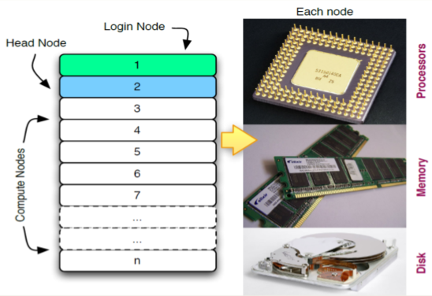
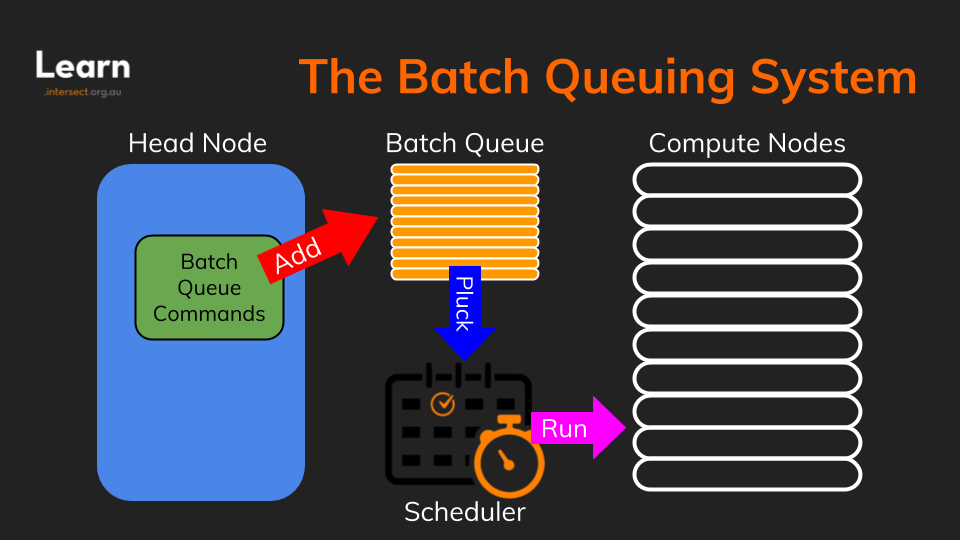

> Learning objectives:
> - Explain how the login, head and compute nodes are related
> - Explain the role of the scheduler
> - Explain how using HPC differs from using a laptop or desktop computer
{: .objective}

In the previous section we introduced the concept that HPC clusters are comprised of a group of individual *nodes* (also called *servers*, *computers* or *machines*). In this section we take a closer look at the different types of nodes, and how they interact.

# Know your nodes
Each node in an HPC cluster has many of the same components as any other computer, including CPUs (also called *processors* or *cores*), *memory* (or RAM) and *disk space*. CPUs are a computer’s tool for actually running programs and calculations. Information about a current task is stored in the computer’s memory. Disk is a computer’s long-term storage for information it will need later.

There are actually three main types of nodes:
- **The login node** is the one we see and interact with when we login and work on the HPC. We can use the login note to upload and download files, setup our software and run quick tests. It should never be used for doing actual work.
- **The head node** is the boss node, it manages all the other nodes by giving them jobs to do through a specialised piece of software called the scheduler, which is described in the next section.
- **The compute nodes** are the workers who do the actual work of running jobs. Generally we never need to interact directly with the compute nodes - their work is entirely managed by the head node.

# Understanding the scheduler
An HPC system might have thousands of nodes and thousands of users wanting to process their data at the same time. How do we decide who gets what and when? How do we ensure that a task is run with the resources it needs? This job is handled by a special piece of software called the *scheduler*. It's primary task is to allocate tasks to the compute nodes, making sure that all resources are used as efficiently as possible, and in a an equitable way.

The scheduler used on Raijin is called *PBS* (short for *Portable Batch System*). This is one of several commonly used scheduling software packages. The basic concepts presented are similar regardless of the type of scheduler used, however, the names and syntax of the commands does differ. In addition, HPC clusters may be customised, and therefore the commands shown here may not be exactly the same on other HPC clusters.

# The HPC workflow
In HPC the main unit of work is called a job, which is simply a set of commands we wish to run, and the resources we need to run it. The basic workflow of running a job is:

1. **Login.** First we login to the HPC cluster. As you have likely guessed, when we login we are working on the login node!
2. **Transfer to the HPC.** Once we are logged in we can transfer our data and any scripts we may need to process it from our computer to the HPC.
3. **Test.** Next we probably want to do a test run of a small subset of our processing to make sure that everything is working properly.
4. **Create a job script.** This is really just like any other shell script that we might have created, except that it contains some special instructions for the scheduler, such as how many processors and how much memory we need for the job.
5. **Submit the job.** Once we are satisfied with our job script, we submit the job for processing by running a command that tells the scheduling software that we have a job ready to run. The scheduling software adds our job to a *queue*, which also contains jobs from many other users that are awaiting processing.
6. **Running the job.** When there is enough spare capacity on one or more of the compute nodes the scheduler will pluck a job from the queue (not always in the order you might expect!) and send it to a compute node to process. Once the compute node is finished it informs the head node that the job has completed and then awaits further instructions.
7. **Transfer to our computer.** When the job is complete we can copy the result files back to our computer for analysis and viewing.

TODO: Update HPC workflow diagram to reflect all 7 steps below.

That might seem like a lot to take in, but we will be covering this complete workflow in the next few sections. By the end of this course you will be able to do all these steps and more!
{: .note}

# Jobs Characteristics
Looking at the workflow above you might have noticed a few differences between working on an HPC and working on your own computer. Let's look at some of these in more detail.

- HPC jobs are typically run  *non-interactively*. This is also called a *batch job* and it means that once our job is started we can't interact with it to give it data or inputs.
- Because HPC clusters do not usually allow graphical interfaces, any plots or graphs produced from our program need to be saved to a file so that we can look at them when the job completes.
- Whereas on our own computer our processing starts as soon as we instruct it to, in an HPC cluster our job may sit in the queue for a time before the HPC starts working on it.

# Being A Good Citizen

If there is one golden rule for working on an HPC cluster, it would have to be **"don't run jobs on the login node"**. HPC clusters are designed to have all the heavy lifting done by compute nodes. It's fine to run small tests to make sure everything is working when you are logged into the login node, but any real work needs to be given to the scheduler to handle by submitting a job. Not doing this can stop the login node from working properly and seriously limit the effectiveness of the HPC cluster.

[Go to the next module]({{ site.baseurl }}/modules/03-logging-in)
{: .next-link}
