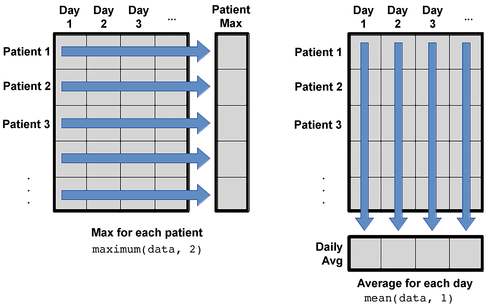
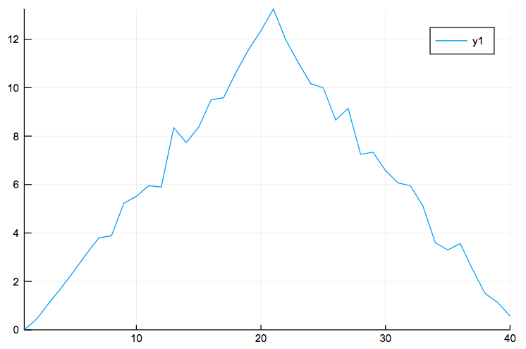
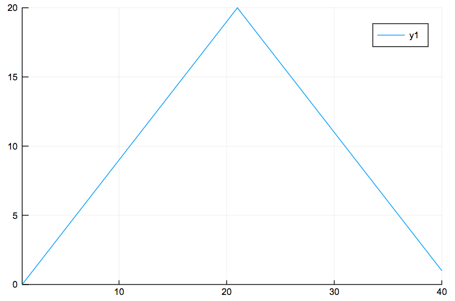
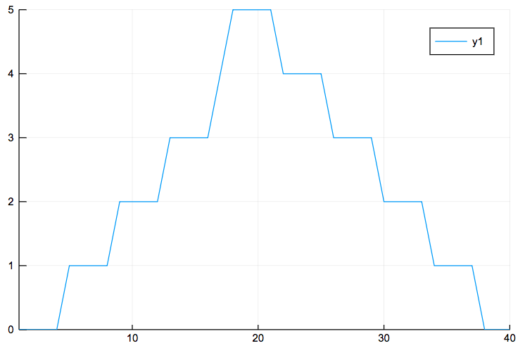
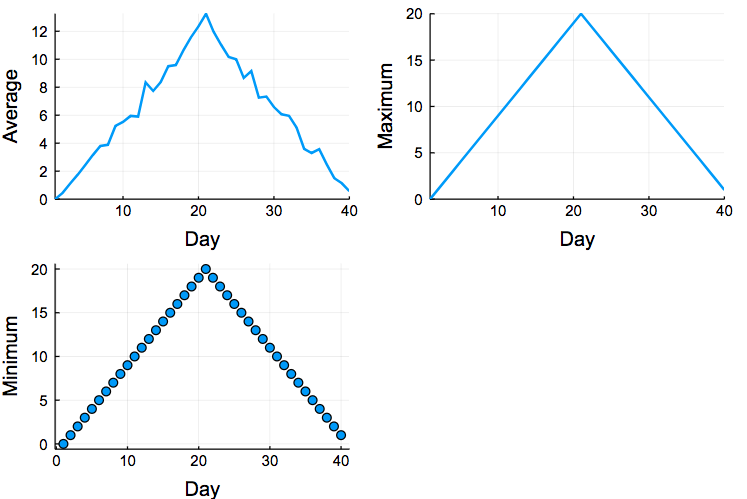
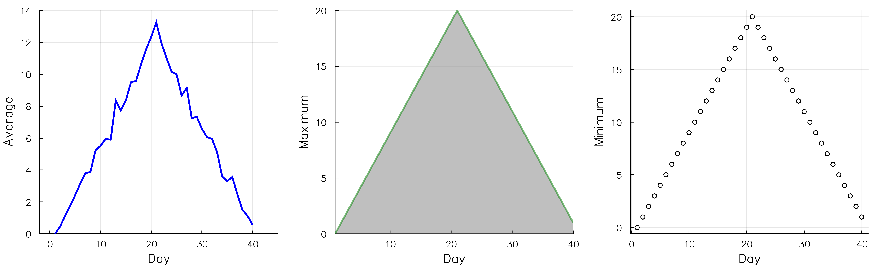

  <script language="javascript"> 
    function toggle(num) {
      var ele = document.getElementById("toggleText" + num);
      var text = document.getElementById("displayText" + num);
      if(ele.style.display == "block") {
        ele.style.display = "none";
        text.innerHTML = "show";
      }
      else {
        ele.style.display = "block";
        text.innerHTML = "hide";
      }
   } 
  </script>

> Learning objectives:
> - ...
> - ...
> - ...
{: .objective}

Text Text Text Text Text Text Text Text Text Text Text Text Text Text Text Text Text Text Text Text Text Text Text Text Text Text Text Text Text Text Text Text Text Text Text Text Text Text Text Text Text Text Text Text Text Text Text Text Text Text Text Text Text Text Text Text Text Text Text Text Text Text Text Text Text Text Text Text Text Text Text Text Text Text Text Text Text Text Text Text 

# Packages in Julia
Most of the times, Julia doesn't have built-in functions for more advanced things, such as plotting, data manipulation etc. However, it has more than 1700 registered packages, which are libraries that contain functions. Please find a full list of all the available packages in Julia in the following link:
https://pkg.julialang.org/

The first time you use a package on a given Julia installation, you need to explicitly add it:
```python
Pkg.add("package_name")
```
{: .source}

Every time you use Julia (start a new session at the REPL, or open a notebook for the first time, for example), you load the package with the using keyword
```python
using package_name
```
{: .source}

In our tutorial, we will start using some packages, namely "CSV" and "Dataframes" to load a csv file and the "Plots" package for our plotting. 

```python
using CSV
using DataFrames
using Plots
```
{: .source}

# Load files
Let's load our CSV file:
```python
data2 = CSV.read("./data/inflammation-01.csv", delim=",",header=false)
```
{: .source}

If we check the type of the data2 variable, we will see that it is a Dataframe. We can check the dimensions of this Dataframe  using the size function:
```python
size(data2)
```
{: .source}
which gives us the number of the rows and columns. We are also able to check the number of either the rows or the columns:
```python
size(data2,1)
size(data2,2)
```
{: .source}

The scope of this introductory course doesn't cover Dataframes, which is a more complex topic, so we are going to load a csv file as a simple 2 dimensional array
```python
data=readdlm("./data/inflammation-01.csv",',')
```
{: .source}

```python
60×40 Array{Float64,2}:
 0.0  0.0  1.0  3.0  1.0  2.0  4.0  7.0  …  7.0  3.0  4.0  2.0  3.0  0.0  0.0
 0.0  1.0  2.0  1.0  2.0  1.0  3.0  2.0     4.0  5.0  5.0  1.0  1.0  0.0  1.0
 0.0  1.0  1.0  3.0  3.0  2.0  6.0  2.0     2.0  2.0  3.0  2.0  2.0  1.0  1.0
 0.0  0.0  2.0  0.0  4.0  2.0  2.0  1.0     3.0  3.0  4.0  2.0  3.0  2.0  1.0
 0.0  1.0  1.0  3.0  3.0  1.0  3.0  5.0     2.0  2.0  4.0  2.0  0.0  1.0  1.0
 0.0  0.0  1.0  2.0  2.0  4.0  2.0  1.0  …  3.0  5.0  4.0  4.0  3.0  2.0  1.0
 0.0  0.0  2.0  2.0  4.0  2.0  2.0  5.0     2.0  3.0  5.0  4.0  1.0  1.0  1.0
 0.0  0.0  1.0  2.0  3.0  1.0  2.0  3.0     5.0  2.0  5.0  3.0  2.0  2.0  1.0
 0.0  0.0  0.0  3.0  1.0  5.0  6.0  5.0     7.0  6.0  3.0  2.0  1.0  0.0  0.0
 0.0  1.0  1.0  2.0  1.0  3.0  5.0  3.0     5.0  1.0  4.0  1.0  2.0  0.0  0.0
 0.0  1.0  0.0  0.0  4.0  3.0  3.0  5.0  …  5.0  5.0  3.0  3.0  2.0  2.0  1.0
 0.0  1.0  0.0  0.0  3.0  4.0  2.0  7.0     4.0  5.0  5.0  4.0  0.0  1.0  1.0
 0.0  0.0  2.0  1.0  4.0  3.0  6.0  4.0     3.0  5.0  4.0  2.0  3.0  0.0  1.0
 ⋮                        ⋮              ⋱            ⋮                      
 0.0  0.0  1.0  3.0  2.0  5.0  1.0  2.0     3.0  1.0  5.0  4.0  3.0  0.0  0.0
 0.0  0.0  1.0  2.0  3.0  4.0  5.0  7.0     4.0  1.0  4.0  2.0  2.0  2.0  1.0
 0.0  1.0  2.0  1.0  1.0  3.0  5.0  3.0  …  3.0  6.0  3.0  4.0  1.0  2.0  0.0
 0.0  1.0  2.0  2.0  3.0  5.0  2.0  4.0     1.0  3.0  2.0  1.0  3.0  1.0  0.0
 0.0  0.0  0.0  2.0  4.0  4.0  5.0  3.0     5.0  2.0  2.0  4.0  1.0  2.0  1.0
 0.0  0.0  2.0  1.0  1.0  4.0  4.0  7.0     4.0  1.0  4.0  2.0  2.0  2.0  1.0
 0.0  1.0  2.0  1.0  1.0  4.0  5.0  4.0     2.0  2.0  5.0  1.0  0.0  0.0  1.0
 0.0  0.0  1.0  3.0  2.0  3.0  6.0  4.0  …  5.0  4.0  5.0  3.0  3.0  0.0  1.0
 0.0  1.0  1.0  2.0  2.0  5.0  1.0  7.0     6.0  3.0  4.0  2.0  2.0  1.0  1.0
 0.0  1.0  1.0  1.0  4.0  1.0  6.0  4.0     4.0  3.0  5.0  2.0  1.0  1.0  1.0
 0.0  0.0  0.0  1.0  4.0  5.0  6.0  3.0     6.0  5.0  5.0  2.0  0.0  2.0  0.0
 0.0  0.0  1.0  0.0  3.0  2.0  5.0  4.0     5.0  4.0  1.0  3.0  1.0  1.0  0.0
```
{: .output}

and check the size of the data array
```python
size(data)
```
{: .source}
```python
(60, 40)
```
{: .output}
and its type
```python
typeof(data)
```
{: .source}
```python
Array{Float64,2}
```
{: .output}


# Slicing
In this section, we are going to learn how to select elements of the array. To select an element, you need to define the name of the array followed by the square brackets and within the brackets you need to define the number of the row and column. For example, if we would like to select the element from the first row and the first column:
```python
println("First value in data: ",data[1,1])
```
{: .source}
```python
First value in data: 0.0
```
{: .output}
or the item from the last row and last column
```python
println("Last value in data: ",data[end,end])
```
{: .source}
```python
Last value in data: 0.0
```
{: .output}
or any other element by defining the number of the row and column
```python
println("Middle value in data: ",data[30,20])
```
{: .source}
```python
Middle value in data: 16.0
```
{: .output}

You can also select multiple rows or columns at once
```python
data[1:4,1:10]
```
{: .source}
```python
4×10 Array{Float64,2}:
 0.0  0.0  1.0  3.0  1.0  2.0  4.0  7.0  8.0  3.0
 0.0  1.0  2.0  1.0  2.0  1.0  3.0  2.0  2.0  6.0
 0.0  1.0  1.0  3.0  3.0  2.0  6.0  2.0  5.0  9.0
 0.0  0.0  2.0  0.0  4.0  2.0  2.0  1.0  6.0  7.0
```
{: .output}
In the previous example, we have selected all the elements from row 1 to 4 and from column 1 to 10. 

It is not necessary to slice an array starting from the beginning. We can slice using any numbers of the rows and columns
```python
data[5:10,5:10]
```
{: .source}
```python
6×6 Array{Float64,2}:
 3.0  1.0  3.0  5.0  2.0  4.0
 2.0  4.0  2.0  1.0  6.0  4.0
 4.0  2.0  2.0  5.0  5.0  8.0
 3.0  1.0  2.0  3.0  5.0  3.0
 1.0  5.0  6.0  5.0  5.0  8.0
 1.0  3.0  5.0  3.0  5.0  8.0
```
{: .output}

Another example
```python
data_small = data[1:4,36:end]
```
{: .source}
```python
4×5 Array{Float64,2}:
 4.0  2.0  3.0  0.0  0.0
 5.0  1.0  1.0  0.0  1.0
 3.0  2.0  2.0  1.0  1.0
 4.0  2.0  3.0  2.0  1.0
```
{: .output}

You can also slice the array by selecting the rows 1, 4, 7 and 10 (or rows 1 to 10 with a step of 3) and the columns 1 to 10 with a step of 2
```python
data[1:3:10,1:2:10]
```
{: .source}
```python
4×5 Array{Float64,2}:
 0.0  1.0  1.0  4.0  8.0
 0.0  2.0  4.0  2.0  6.0
 0.0  2.0  4.0  2.0  5.0
 0.0  1.0  1.0  5.0  5.0
```
{: .output}

If we would like to select all the rows or columns, we can use the : without defining anything
```python
data[:,1]
```
{: .source}
```python
60-element Array{Float64,1}:
 0.0
 0.0
 0.0
 0.0
 0.0
 0.0
 0.0
 0.0
 0.0
 0.0
 0.0
 0.0
 0.0
 ⋮  
 0.0
 0.0
 0.0
 0.0
 0.0
 0.0
 0.0
 0.0
 0.0
 0.0
 0.0
 0.0
```
{: .output}
or for the columns
```python
data[1,:]
```
{: .source}
```python
40-element Array{Float64,1}:
  0.0
  0.0
  1.0
  3.0
  1.0
  2.0
  4.0
  7.0
  8.0
  3.0
  3.0
  3.0
 10.0
  ⋮  
  8.0
  8.0
  4.0
  4.0
  5.0
  7.0
  3.0
  4.0
  2.0
  3.0
  0.0
  0.0
```
{: .output}

Another example
```python
data[1:4,end-2]
```
{: .source}
```python
4-element Array{Float64,1}:
 3.0
 1.0
 2.0
 3.0
```
{: .output}

# Mathematical operations and basic statistics in arrays
We can also do operations in arrays
```python
doubledata = data * 2
```
{: .source}
```python
60×40 Array{Float64,2}:
 0.0  0.0  2.0  6.0  2.0   4.0   8.0  14.0  …   6.0   8.0  4.0  6.0  0.0  0.0
 0.0  2.0  4.0  2.0  4.0   2.0   6.0   4.0     10.0  10.0  2.0  2.0  0.0  2.0
 0.0  2.0  2.0  6.0  6.0   4.0  12.0   4.0      4.0   6.0  4.0  4.0  2.0  2.0
 0.0  0.0  4.0  0.0  8.0   4.0   4.0   2.0      6.0   8.0  4.0  6.0  4.0  2.0
 0.0  2.0  2.0  6.0  6.0   2.0   6.0  10.0      4.0   8.0  4.0  0.0  2.0  2.0
 0.0  0.0  2.0  4.0  4.0   8.0   4.0   2.0  …  10.0   8.0  8.0  6.0  4.0  2.0
 0.0  0.0  4.0  4.0  8.0   4.0   4.0  10.0      6.0  10.0  8.0  2.0  2.0  2.0
 0.0  0.0  2.0  4.0  6.0   2.0   4.0   6.0      4.0  10.0  6.0  4.0  4.0  2.0
 0.0  0.0  0.0  6.0  2.0  10.0  12.0  10.0     12.0   6.0  4.0  2.0  0.0  0.0
 0.0  2.0  2.0  4.0  2.0   6.0  10.0   6.0      2.0   8.0  2.0  4.0  0.0  0.0
 0.0  2.0  0.0  0.0  8.0   6.0   6.0  10.0  …  10.0   6.0  6.0  4.0  4.0  2.0
 0.0  2.0  0.0  0.0  6.0   8.0   4.0  14.0     10.0  10.0  8.0  0.0  2.0  2.0
 0.0  0.0  4.0  2.0  8.0   6.0  12.0   8.0     10.0   8.0  4.0  6.0  0.0  2.0
 ⋮                         ⋮                ⋱         ⋮                      
 0.0  0.0  2.0  6.0  4.0  10.0   2.0   4.0      2.0  10.0  8.0  6.0  0.0  0.0
 0.0  0.0  2.0  4.0  6.0   8.0  10.0  14.0      2.0   8.0  4.0  4.0  4.0  2.0
 0.0  2.0  4.0  2.0  2.0   6.0  10.0   6.0  …  12.0   6.0  8.0  2.0  4.0  0.0
 0.0  2.0  4.0  4.0  6.0  10.0   4.0   8.0      6.0   4.0  2.0  6.0  2.0  0.0
 0.0  0.0  0.0  4.0  8.0   8.0  10.0   6.0      4.0   4.0  8.0  2.0  4.0  2.0
 0.0  0.0  4.0  2.0  2.0   8.0   8.0  14.0      2.0   8.0  4.0  4.0  4.0  2.0
 0.0  2.0  4.0  2.0  2.0   8.0  10.0   8.0      4.0  10.0  2.0  0.0  0.0  2.0
 0.0  0.0  2.0  6.0  4.0   6.0  12.0   8.0  …   8.0  10.0  6.0  6.0  0.0  2.0
 0.0  2.0  2.0  4.0  4.0  10.0   2.0  14.0      6.0   8.0  4.0  4.0  2.0  2.0
 0.0  2.0  2.0  2.0  8.0   2.0  12.0   8.0      6.0  10.0  4.0  2.0  2.0  2.0
 0.0  0.0  0.0  2.0  8.0  10.0  12.0   6.0     10.0  10.0  4.0  0.0  4.0  0.0
 0.0  0.0  2.0  0.0  6.0   4.0  10.0   8.0      8.0   2.0  6.0  2.0  2.0  0.0
```
{: .output}
or
```python
tripledata = data + doubledata
```
{: .source}
```python
60×40 Array{Float64,2}:
 0.0  0.0  3.0  9.0   3.0   6.0  12.0  …   9.0  12.0   6.0  9.0  0.0  0.0
 0.0  3.0  6.0  3.0   6.0   3.0   9.0     15.0  15.0   3.0  3.0  0.0  3.0
 0.0  3.0  3.0  9.0   9.0   6.0  18.0      6.0   9.0   6.0  6.0  3.0  3.0
 0.0  0.0  6.0  0.0  12.0   6.0   6.0      9.0  12.0   6.0  9.0  6.0  3.0
 0.0  3.0  3.0  9.0   9.0   3.0   9.0      6.0  12.0   6.0  0.0  3.0  3.0
 0.0  0.0  3.0  6.0   6.0  12.0   6.0  …  15.0  12.0  12.0  9.0  6.0  3.0
 0.0  0.0  6.0  6.0  12.0   6.0   6.0      9.0  15.0  12.0  3.0  3.0  3.0
 0.0  0.0  3.0  6.0   9.0   3.0   6.0      6.0  15.0   9.0  6.0  6.0  3.0
 0.0  0.0  0.0  9.0   3.0  15.0  18.0     18.0   9.0   6.0  3.0  0.0  0.0
 0.0  3.0  3.0  6.0   3.0   9.0  15.0      3.0  12.0   3.0  6.0  0.0  0.0
 0.0  3.0  0.0  0.0  12.0   9.0   9.0  …  15.0   9.0   9.0  6.0  6.0  3.0
 0.0  3.0  0.0  0.0   9.0  12.0   6.0     15.0  15.0  12.0  0.0  3.0  3.0
 0.0  0.0  6.0  3.0  12.0   9.0  18.0     15.0  12.0   6.0  9.0  0.0  3.0
 ⋮                          ⋮          ⋱         ⋮                       
 0.0  0.0  3.0  9.0   6.0  15.0   3.0      3.0  15.0  12.0  9.0  0.0  0.0
 0.0  0.0  3.0  6.0   9.0  12.0  15.0      3.0  12.0   6.0  6.0  6.0  3.0
 0.0  3.0  6.0  3.0   3.0   9.0  15.0  …  18.0   9.0  12.0  3.0  6.0  0.0
 0.0  3.0  6.0  6.0   9.0  15.0   6.0      9.0   6.0   3.0  9.0  3.0  0.0
 0.0  0.0  0.0  6.0  12.0  12.0  15.0      6.0   6.0  12.0  3.0  6.0  3.0
 0.0  0.0  6.0  3.0   3.0  12.0  12.0      3.0  12.0   6.0  6.0  6.0  3.0
 0.0  3.0  6.0  3.0   3.0  12.0  15.0      6.0  15.0   3.0  0.0  0.0  3.0
 0.0  0.0  3.0  9.0   6.0   9.0  18.0  …  12.0  15.0   9.0  9.0  0.0  3.0
 0.0  3.0  3.0  6.0   6.0  15.0   3.0      9.0  12.0   6.0  6.0  3.0  3.0
 0.0  3.0  3.0  3.0  12.0   3.0  18.0      9.0  15.0   6.0  3.0  3.0  3.0
 0.0  0.0  0.0  3.0  12.0  15.0  18.0     15.0  15.0   6.0  0.0  6.0  0.0
 0.0  0.0  3.0  0.0   9.0   6.0  15.0     12.0   3.0   9.0  3.0  3.0  0.0
```
{: .output}

We can also perform basic statistics in the array
```python
mean(data)
```
{: .source}
```python
6.14875
```
{: .output}

```python
maximum(data)
```
{: .source}
```python
20.0
```
{: .output}

```python
minimum(data)
```
{: .source}
```python
0.0
```
{: .output}

```python
std(data)
```
{: .source}
```python
4.614794712852068
```
{: .output}

If we would like to select the data for patient 1, we have to select the first row and all the columns.
```python
patient_1 = data[1,:]
```
{: .source}
```python
40-element Array{Float64,1}:
  0.0
  0.0
  1.0
  3.0
  1.0
  2.0
  4.0
  7.0
  8.0
  3.0
  3.0
  3.0
 10.0
  ⋮  
  8.0
  8.0
  4.0
  4.0
  5.0
  7.0
  3.0
  4.0
  2.0
  3.0
  0.0
  0.0
```
{: .output}

Calculate the maximum inflammation for patient 1
```python
println("Maximum inflammation for patient 1: ", maximum(patient_1))
```
{: .source}
```python
Maximum inflammation for patient 1: 18.0
```
{: .output}

If we would like to calculate the maximum inflammation for patient 3
```python
println("Maximum inflammation for patient 3: ", maximum(data[3,:]))
```
{: .source}
```python
Maximum inflammation for patient 3: 19.0
```
{: .output}

But what if we would like to do calculations for all patients (across the rows) or for all days (across the columns)? There should be an automatic way to do that kind of operations. Let's have a look at the help of the maximum function. 
```python
?maximum
```
{: .source}
There is an argument in the maximum function called dims, which can be either 1 or 2 if we would like to apply the function across the columns or the rows, respectively.



Check the size when we use dims=1 and for dims=2
```python
size(maximum(data,1))
```
{: .source}
```python
(1, 40)
```
{: .output}

```python
size(mean(data,2))
```
{: .source}
```python
(60, 1)
```
{: .output}

# Plotting
Let's create our plot for the average inflammation per day for our dataset.
```python
avg_inflammation = mean(data,1);
avg_inflammation = avg_inflammation';
days=1:40;
plot(days,avg_inflammation)
```
{: .source}



Now the maximum inflammation per day
```python
plot(days,maximum(data,1)')
```
{: .source}



And the minimum inflammation per day
Now the maximum inflammation per day
```python
plot(days,minimum(data,1)')
```
{: .source}



If we would like to summarise and create a figure with the three previous plots as subfigures
```python
data = readdlm("./data/inflammation-01.csv", ',');

plot(plot(days,mean(data,1)', ylabel="Average", label="Mean"),
     plot(days,maximum(data,1)', ylabel="Maximum", label="Max"),
     plot(days,maximum(data,1)', 
        seriestype=:scatter, ylabel="Minimum", label="Min"), lw=2, xlabel="Day", legend=false, size=(600,400)
)
```
{: .source}



or with a bit more editing for the aesthetics of the plot
```python
data = readdlm("./data/inflammation-01.csv", ',');

p1=plot(days,mean(data,1)', ylabel="Average", label="Mean", color="blue", xlims=(-2,45), ylims=(0,14))
p2=plot(days,maximum(data,1)', ylabel="Maximum", label="Max", c="green",alpha=0.5, fill=(0,"gray"))
#marker="white", markersize=5, markershape=:s) #:o, :x
p3=plot(days,maximum(data,1)', seriestype=:scatter, ylabel="Minimum", label="Min", marker=(:white,2,:o,stroke(1,:black))) #:o, :x

plot(p1,p2,p3,layout=(1,3), legend=false, xlabel="Day", lw=2, size=(1000,300), grid=true)
```
{: .source}



If you would like to export the plot, then you need to pass the final plot into a variable and then use the savefig command to export it
```python
pfinal=plot(p1,p2,p3,layout=(1,3), legend=false, xlabel="Day", lw=2, size=(1000,300), grid=true)
savefig(pfinal,"myplot.png")
```
{: .source}
However, if you pass the plot into a variable, Jupyter does not display the plot. If you would like to display the plot, you need to use the display function
```python
display(pfinal)
```
{: .source}


# Exercise
Question is ......

  <a id="displayText" href="javascript:toggle(1);">Show Solution code</a>
  <div id="toggleText1" style="display: none">
x <- sample(100) <br />
mean.x <- mean(x) <br />
  </div>


Another way:


<details>
  <summary>
    Collapsed Block
  </summary>

  <h2 id="header">Header</h2>
  
  <code>racket
  (define (sqr x)
  (* x x))
  </code>
</details>

## Next
In the next module we're going ........................

[Go to Module 3 (Loops)]({{ site.baseurl }}/modules/03-loops){: .next-link}
