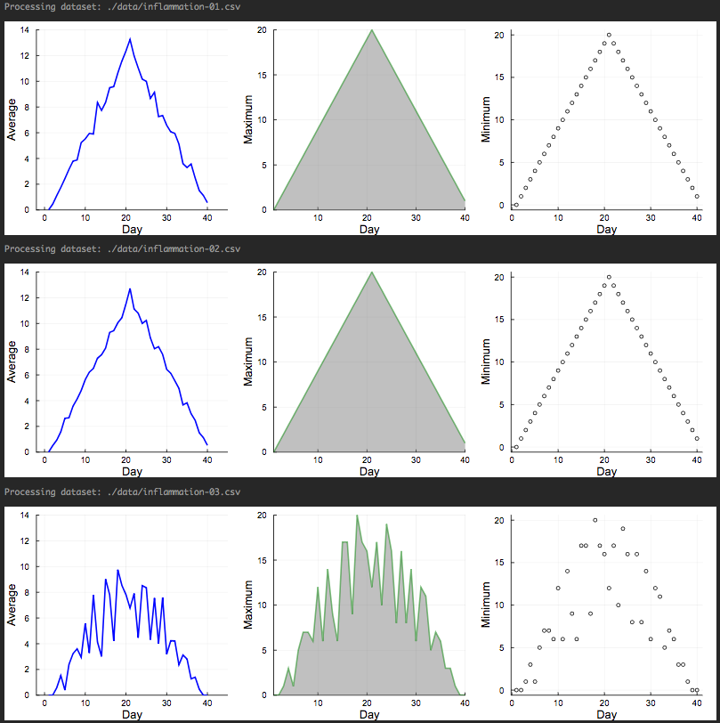

> Learning objectives:
> - ...
> - ...
> - ...
> - ...
{: .objective}

In this section, you will learn how to perform repeating actions using a concept called loops in programming. There are two types of loops, **for** and **while** loop, and we are going to explore both here. 

Let's create a variable called *word* and store the word "lead" which is a string:
```matlab
word = "lead"
```
{: .source}

If we would like to print each character of the string, we have to use the **println** command for each element of the variable *word*:
```matlab
println(word[1])
println(word[2])
println(word[3])
println(word[4])
```
{: .source}

However, this is a not a good practise because:
1. It doesn’t scale: if we want to print the characters in a string that’s hundreds of letters long, we’d be better off just typing them in.
2. It’s fragile: if we give it a longer string, it only prints part of the data, and if we give it a shorter one, it produces an error because we’re asking for characters that don’t exist.

Here is a bad practise of the previous technique. If you change the word from "lead" to "tin", now the previous code is not applicable anymore and it will give you an error:
```matlab
word = "tin";
println(word[1])
println(word[2])
println(word[3])
println(word[4])
```
{: .source}

```matlab
t
i
n
BoundsError: attempt to access "tin"
  at index [4]
```
{: .output}


# for loops

Here is a better example of how to do repetitive actions in programming using loops. Let's explore first how to use a **for** loop.
```matlab
word = "lead";
for char in word
    println(char)
end
```
{: .source}
where each character (char) in the variable *word* is looped through and printed one character after another. This loop will run for all the elements of the variable *word*. You can call the loop variable anything you like, and it is a good practice to indent anything you want to run inside the loop. **for** is a keyword to define the beginning of a loop, **in** is another keyword for the collection of elements you will use to run the loop, and the **end** keyword signify the end of the loop body. Within the loop body, you define the commands that are going to run for each iteration of the loop. 

```matlab
l
e
a
d
```
{: .output}

Now, if you change the variable *word*, you will no longer have an error message, and each character of this new word will be printed:
```matlab
word = "oxygen";
for char in word
    println(char)
end
```
{: .source}

```matlab
o
x
y
g
e
n
```
{: .output}

The generic syntax of a **for** loop is as follows:
```matlab
for variable in collection
    do things
end
```
{: .source}

and here is a diagram that explains how the **for** loop is working

**ADD LOOP DIAGRAM**

As mentioned before, the name of the loop variable can be anything you like, however, remember that it is always useful to give meaningful names to the variables
```matlab
word = "oxygen";
for banana in word
    println(banana)
end
```
{: .source}
```matlab
o
x
y
g
e
n
```
{: .output}

Let's try now to calculate the number of elements in a collection:
```matlab
len = 0;
for vowel in "aeiou"
    len = len + 1
end

println("There are $len vowels in the collection")
```
{: .source}
```
There are 5 vowels in the collection
```
{: .output}
In this example, we create a new variable called *len* outside the loop, and we initialise its value to 0. In each iteration, i.e. for each element of the collection *"aeriou"*, we add +1 in the previous value of the variable *len*. 

Of course, there is a built-in function to calculate the length of a string or the length of a list called **length**
```matlab
println("The length of the collection is: ", length("aeiou"))
```
{: .source}
```
The length of the collection is: 5
```
{: .output}

But what is happening to the loop variable after you run a loop? In the example below, we create the variable *letter* outside the loop and then we use this variable as the loop variable. After the loop, we print the value of the variable *letter* 
```matlab
letter = "z"
for letter in "abc"
    println(letter)
end

println("After the loop, letter is: $letter")
```
{: .source}
```
a
b
c
After the loop, letter is: c
```
{: .output}
As you can see, the loop variable is just a variable that’s being used to record progress in a loop. It still exists after the loop is over, and we can re-use variables previously defined as loop variables as well. 


# while loops

Another type of loops is the **while** loop. The syntax of the **while** loop is different than that of a **for** loop. A **while** loop is running using a condition as a test, which means that the loop will run until this condition becomes *False*. As long as this condition is valid (*True*), the loop will keep running. This can be quite tricky because **while** loop can run forever, if we make mistakes and the condition never becomes *False*. 

Here is an example of a **while** loop that prints a number until the number is less or equal to 10:
```matlab
number=1

while number<=10
    println("The number is: $number")
    number = number + 1
end
```
{: .source}
```
The number is: 1
The number is: 2
The number is: 3
The number is: 4
The number is: 5
The number is: 6
The number is: 7
The number is: 8
The number is: 9
The number is: 10
```
{: .output}
The things to remember in a **while** loop. First, you always need to initialise the loop variable before you use it in the condition within the loop. Second, you always need to have a command to update the value of the loop variable, otherwise this loop will keep running.  

**Be careful** though with the location of the increment of the loop variable in the **while** loops because it can lead to wrong results
```matlab
number=1

while number<=10
    number = number + 1
    println("The number is: $number")
end
```
{: .source}
```
The number is: 2
The number is: 3
The number is: 4
The number is: 5
The number is: 6
The number is: 7
The number is: 8
The number is: 9
The number is: 10
The number is: 11
```
{: .output}

The generic sytnax of a while loop is
```matlab
while condition
    operations within the loop
    increment
end
```
{: .source}

**ADD A DIAGRAM**

Another example of a while loop
```matlab
names = ["Ted", "Robyn", "Barney", "Lily", "Marshall"]

i = 1
while i<=length(names)
    selected_name = names[i]
    println("Hi $selected_name. How are you?")
    i += 1
end
```
{: .source}
```
Hi Ted. How are you?
Hi Robyn. How are you?
Hi Barney. How are you?
Hi Lily. How are you?
Hi Marshall. How are you?
```
{: .output}


# Nested loops and prefilled arrays

It is useful to know that a common technique when you want to calculate or update the values of a list or array is to create a list or array outside the loop filled with zeros and then update the values of the elements instead of changing the size of the list or array in each iteration of the loop. For example, let's create a 3 by 3 array filled with zeros outside the loop and then run a nested loop to update the values for each element of the array. In this case, we use an outer loop to scan the number of the row and an inner loop to scan the number of the column:
```matlab
m,n = 3,3
A = fill(0, (m,n))

for i in 1:m
    for j in 1:n
        A[i,j] = i+j
    end
end

A
```
{: .source}
```
3×3 Array{Int64,2}:
 2  3  4
 3  4  5
 4  5  6
```
{: .output}

In Julia, a nested loop can be also written in a single line as
```matlab
m,n = 3,3
B = fill(0, (m,n))

for i in 1:m, j in 1:n
        B[i,j] = i+j
end

B
```
{: .source}
```
3×3 Array{Int64,2}:
 2  3  4
 3  4  5
 4  5  6
```
{: .output}
or in a much compact way 
```matlab
C = [i+j for i in 1:m, j in 1:n]
```
{: .source}
```
3×3 Array{Int64,2}:
 2  3  4
 3  4  5
 4  5  6
```
{: .output}

> # Exercise
>
> Using the range function (if you don't know how to use it, run the help on the range function), write a loop that uses range to print the first 5 natural numbers.
{: .inset}

> # Exercise
>
> Exponentiation is built into Julia:
>
> 5^3
>
> Write a loop that calculates the same result (5^3)
{: .inset}

> # Exercise
>
> Use an array comprehension to create an array that stores the squares for all integers between 1 and 10.
{: .inset}


# Inflammation datasets and loops

Since we know how to run a loop, we can now extend our analysis and run it for multiple inflammation datasets using a **for** loop. Before that let's explore the "Glob" package, which will help us create a list of all the filenames to pass it in the loop. The glob function takes two arguments, a pattern and where to look for the pattern (the path). 
```matlab
glob(pattern,path)
```
{: .source}
In our case, the pattern is "infl*" (this is only one out of many patterns we can use) because all our files are in the form inflammation-two_digit_number.csv. The * symbol is called wildcard and it means that we are looking for a pattern in the filenames that includes the characters "infl" and 0 or more characters (any combination of characters) after that.
```matlab
namelist=glob("infl*","./data/")
```
{: .source}
```matlab
12-element Array{String,1}:
 "./data/inflammation-01.csv"
 "./data/inflammation-02.csv"
 "./data/inflammation-03.csv"
 "./data/inflammation-04.csv"
 "./data/inflammation-05.csv"
 "./data/inflammation-06.csv"
 "./data/inflammation-07.csv"
 "./data/inflammation-08.csv"
 "./data/inflammation-09.csv"
 "./data/inflammation-10.csv"
 "./data/inflammation-11.csv"
 "./data/inflammation-12.csv"
```
{: .output}
If you would also like to to sort the output array, you can use the **sort** function to do that:
```matlab
namelist=sort(glob("infl*","./data/"), rev=false)
```
{: .source}
```matlab
12-element Array{String,1}:
 "./data/inflammation-01.csv"
 "./data/inflammation-02.csv"
 "./data/inflammation-03.csv"
 "./data/inflammation-04.csv"
 "./data/inflammation-05.csv"
 "./data/inflammation-06.csv"
 "./data/inflammation-07.csv"
 "./data/inflammation-08.csv"
 "./data/inflammation-09.csv"
 "./data/inflammation-10.csv"
 "./data/inflammation-11.csv"
 "./data/inflammation-12.csv"
```
{: .output}

So let's try now to apply everything we know to analyse the first 3 datasets and do it as it should be for a new script. Here is the list of commands in the following script:
- Import the packages we are going to use
- Create a list of all the filenames of the csv files and sort the list
- Create a new arrays for the days of the treatment to use it in the x axis of the plot
- Run a loop for the first three elements of the filenames list (the first three datasets)
- Print which dataset we are processing
- Use the sleep function to hold on between each iteration 
- Read the csv file
- Create three plots, one for the average, one for the maximum and one for the minimum inflammation per day
- Create a figure using three subplots
- Display the figure
```matlab
using Glob
using Plots

filenames = sort(glob("infl*","./data/"), rev=false);
days=1:40;

for f in filenames[1:3]
    
    println("Processing dataset: ",f)
    
    sleep(0.5)
    
    data = readdlm(f, ',');
    
    p1=plot(days,mean(data,1)', ylabel="Average", label="Mean", color="blue", xlims=(-2,45), ylims=(0,14))
    p2=plot(days,maximum(data,1)', ylabel="Maximum", label="Max", c="green",alpha=0.5, fill=(0,"gray"))
    p3=plot(days,maximum(data,1)', seriestype=:scatter, ylabel="Minimum", label="Min", marker=(:white,2,:o,stroke(1,:black)))

    p=plot(p1,p2,p3,layout=(1,3), legend=false, xlabel="Day", lw=2,size=(1000,300), grid=true)
    display(p)
end
```
{: .source}




[Go to Module 4 (Conditionals)]({{ site.baseurl }}/modules/04-conditionals){: .next-link}
