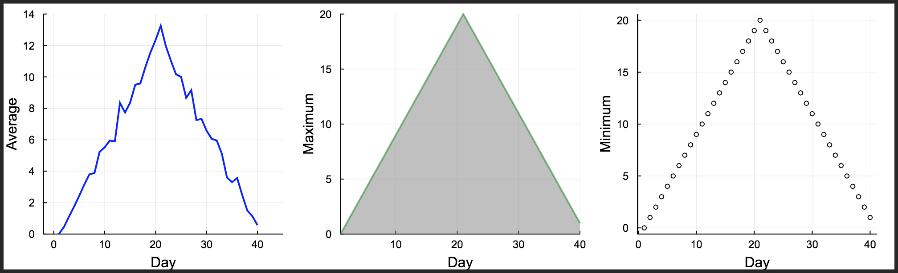
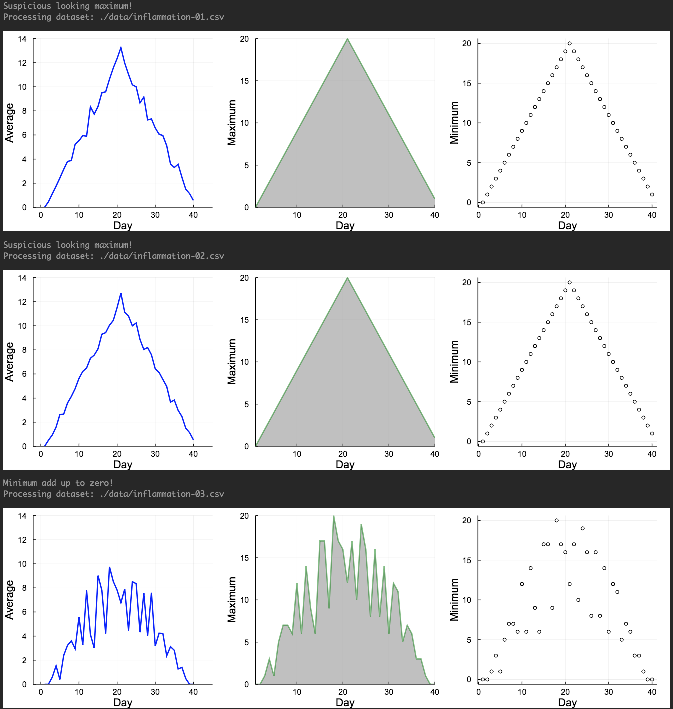

> Learning objectives:
> - ...
> - ...
> - ...
{: .objective}

# Functions
At this point, we have written code to draw some interesting features in our inflammation data, loop over all our data files to quickly draw these plots for each of them, and have Julia make decisions based on what it sees in our data. But, our code is getting pretty long and complicated. What if we had thousands of datasets, and didn’t want to generate a figure for every single one? Commenting out the figure-drawing code is a nuisance. Also, what if we want to use that code again, on a different dataset or at a different point in our program? Cutting and pasting it is going to make our code get very long and very repetitive, very quickly. We’d like a way to package our code so that it is easier to reuse, and Julia provides this by letting us define things called ‘functions’ — a shorthand way of re-executing longer pieces of code. 

Below you can see the generic syntax to create a function in Julia:
```matlab
function function_name(argument1, argument2, ...)
  do things
end
```
{: .source}

Let’s start by creating a function called *fahr_to_celsius* that converts temperature from Fahrenheit to Celsius:
```matlab
function fahr_to_celsius(temperature)
   (temperature-32)*(5/9) 
end
```
{: .source}

Let's now test our function by converting a temperature of 32 Fahrenheit to Celsius
```matlab
println("Freezing point of water: ", fahr_to_celsius(32), " C")
```
{: .source}
```matlab
Freezing point of water: 0.0 C
```
{: .output}

In Julia, as we learnt in loops and conditionals before, there is an alternative and more compact way to declare the function in a single line:
```matlab
fahr_to_celsius2(temperature) = (temperature-32)*(5/9)
```
{: .source}
If you convert 32 Fahrenheit to Celsius using the *fahr_to_celsius2* function, you will get the same answer:
```matlab
println("Freezing point of water: ", fahr_to_celsius2(32), " C")
```
{: .source}
```matlab
Freezing point of water: 0.0 C
```
{: .output}

You can also create a so called "anonymous" function, without giving a function name, using either of these syntaxes:
```matlab
??????temperature -> (temperature-32)*(5/9)

function (temperature)
    (temperature-32)*(5/9) 
end
```
{: .source}
```matlab
?????????????
```
{: .output}
This creates a function taking one argument *temperature* and returning the value of the *(temperature-32)*(5/9)* at that value. Notice that the result is a generic function, but with a compiler-generated name based on consecutive numbering. The primary use for anonymous functions is passing them to functions which take other functions as arguments. A classic example is the **map()** function, which applies a function to each value of an array and returns a new array containing the resulting values. We will talk about the **map()** function later in this section. 

Let's create now a function that converts Celsius to Kelvin. 
```matlab
function celsius_to_kelvin(temperature_c)
    temperature_c += 273.15
end
```
{: .source}
and let's test the function to convert a temperature from Celsius to Kelvin:
```matlab
celsius_to_kelvin(0)
```
{: .source}
```matlab
273.15
```
{: .output}


# Chain functions
So now, if you would like to create a function to convert Fahrenheit to Kelvin, you can do it using the two functions you previously created, namely *fahr_to_celsius* and *celsius_to_kelvin*:
```matlab
function fahr_to_kelvin(temperature_f)
    temperature_c = fahr_to_celsius(temperature_f)
    temperature_k = celsius_to_kelvin(temperature_c)
end
```
{: .source}
Now, if you test the function for a temperature of 212 Fahrenheit, you will get a temperature of 373.15 Kelvin. Note that the ouput value will correspond to the *temperature_k* variable within the function as it is the last calculated variable within the function. Of course, you can always return more outputs from your function, which we will learn how to do it in the next subsection. 
```matlab
fahr_to_kelvin(212)
```
{: .source}
```matlab
373.15
```
{: .output}

It is good to know that there is an alternative way to do the previous convertion, i.e. you could have chained the two functions in order to get the same result without creating another function:
```matlab
celsius_to_kelvin(fahr_to_celsius(212))
```
{: .source}
```matlab
373.15
```
{: .output}
In this case, first we convert the temperature of 212 Fahrenheit to Celsius, and then we pass this new value (in Celsius) as an input in the *celsius_to_kelvin* function, with the final result being in Kelvin. 


# Return values
By default, the function will return the value of the last variable that was defined within the function. For example, the *fahr_to_kelvin* function will return the value of the *temperature_k* variable, which is the last command within the function. If we would like to return more than one values, we need to add a command called **return** before the end of the function. For example:
```matlab
function fahr_to_kelvin(temperature_f)
    temperature_c = fahr_to_celsius(temperature_f)
    temperature_k = celcius_to_kelvin(temperature_c)
    return temperature_c, temperature_k
end

a, b = fahr_to_kelvin(10)
```
{: .source}
```matlab
(-12.222222222222223, 260.92777777777775)
```
{: .output}

In Julia, another way to return multiple values without using the **return** command is:
```matlab
function new_function(a,b)
    a+b, a-b
end

x, y = new_function(1,3)
```
{: .source}
```matlab
(4, -2)
```
{: .source}


# Default values

Although most of the functions have many arguments, you usually call them using only a few. This means that the other arguments of the function have *default* values. To define arguments with default values in the function, you have to use the assign (=) symbol when you define them:
```matlab
function myprint(a,b=1,c=10)
    println("a:",a," b:",b," c:",c)
end

myprint(1)
```
{: .source}
In this example, the arguments *b* and *c* have a default value of 1 and 10, respectively. This way, when we call the function without defining the *b* and *c* arguments, the function will run and the arguments b and c will take their default values.
```matlab
a:1 b:1 c:10
```
{: .output}

If I would like to overwrite the default values then:
```matlab
myprint(1,5)
```
{: .source}
```matlab
a:1 b:5 c:10
```
{: .output}

?????????????????Be careful! The order you define the arguments when you call the function is important. In the example of *myprint(1,5)*, 1 will be assigned to the argument *a*, 5 will replace the default value of argument *b*, and since we haven't defined a value for the argument *c*, it will have its default value, i.e. 10. However, if, when you call the function, you define the name of the argument, then the order is not important. For example, the order is important in this case, if we would like to define a=1 and b=5
```matlab
myprint(1,5)
```
{: .source}
however the order is not important in the following example
```matlab
myprint(b=5,a=1)
```
{: .source}


# Multiple dispatch

Multiple dispatch makes software generic and fast! Let's start by exploring an example. We can declare functions in Julia without giving Julia any information about the types of the input arguments that function will receive:
```matlab
f(x) = (2*x)^3 
```
{: .source}
and then Julia will determine on its own which input argument types make sense and which do not:
```matlab
f(10)
```
{: .source}
```matlab
??????????????????
```
{: .output}
or 
```matlab
f([1, 2, 3])
```
{: .source}
```matlab
??????????????????
```
{: .output}

However, we also have the option to tell Julia explicitly what types our input arguments are allowed to have. For example, let's write a function called *my_func* that only takes strings as inputs.
```matlab
my_funct(a::String, b::String) = println("My inputs a and b are both strings!")
```
{: .source}
You can see here that in order to restrict the type of x and y to Strings, we just follow the input argument name by a double colon (::) and the keyword String, which indicates the accepted type.

Now we'll see if the *my_func* function works on Strings 
```matlab
my_funct("hello", "hi!")
```
{: .source}
```matlab

```
{: .output}
and doesn't work on other input argument types.
```matlab
my_func(3, 4)
```
{: .source}
```matlab

```
{: .output}

Now *my_func* works on integers! But, *my_func* also still works when x and y are strings!
```matlab
my_func("hello", "hi!")
```
{: .source}
```matlab

```
{: .output}
This is starting to get to the heart of multiple dispatch. When we declared

*my_func(a::Int, b::Int) = println("My inputs a and b are both integers!")*

we didn't overwrite or replace

*my_func(a::String, b::String)*

Instead, we just added an additional *method* to the *generic function* called *my_func*. A *generic function* is the abstract concept associated with a particular operation. For example, the generic function **+** represents the concept of addition. A *method* is a specific implementation of a generic function for particular argument types. For example, **+** has methods that accept floating point numbers, integers, matrices, etc. We can use the **methods** command to see how many methods there are for *my_func*.
```matlab
methods(my_func)
```
{: .source}
```matlab

```
{: .output}

So, we now can call *my_func* on integers or strings. When you call *my_func* on a particular set of arguments, Julia will infer the types of the inputs and dispatch the appropriate method. This is the concept behind the multiple dispatch.

Multiple dispatch makes our code generic and fast. Our code can be generic and flexible because we can write code in terms of abstract operations such as addition and multiplication, rather than in terms of specific implementations. At the same time, our code runs quickly because Julia is able to call efficient methods for the relevant types.

To see which method is being dispatched when you call a generic function, you can use the **@which** macro:
```matlab
@which my_func(3, 4)
```
{: .source}
```matlab

```
{: .output}

And we can continue to add other methods to our generic function foo. Let's add one that takes the abstract type Number, which includes subtypes such as Int, Float64, and other objects you would think of as numbers:
```matlab
my_func(a::Number, b::Number) = println("My inputs a and b are both numbers!")
```
{: .source}

We can also add a fallback, duck-typed method for foo that takes inputs of any type:
```matlab
my_func(a, b) = println("I accept inputs of any type!")
```
{: .source}

##Exercise
- Create a function that takes only one argument, which is type Bool, and prints "...."
- Check what method being dispatched when you execute .....
- add the argument to be also string

# Mutating vs non-mutating functions
By convention, functions followed by the exclamation mark symbol (!) after their contents and functions lacking ! do not. 

For example let's use the sort function to sort a list of values
```matlab
v = [3,5,2]
sort(v)
```
{: .source}
```matlab
3-element Array{Int64,1}:
 2
 3
 5
```
{: .output}
However, list v hasn't changed
```matlab
v
```
{: .source}
```matlab
3-element Array{Int64,1}:
 3
 5
 2
```
{: .output}

Now if we run the sort function but with the ! then
```matlab
sort!(v)
```
{: .source}
```matlab
3-element Array{Int64,1}:
 2
 3
 5
```
{: .output}
and the list will retain the sorted format because we used the ! after sort
```matlab
v
```
{: .source}
```matlab
3-element Array{Int64,1}:
 2
 3
 5
```
{: .output}

# Higher order functions

## **map** function
The map function is a "higher-order" function in Julia that takes a function as one of its input arguments. map then applies that function to every element of the data structure you pass it. For example, executing 
```matlab
map(f, [1, 2, 3])
```
{: .source}
will give you an output array where the function f has been applied to all elements of [1,2,3], i.e. [f(1),f(2),f(3)].

Here is an example. We have a function that calculates the cube of a number and we would like to apply this calculation to a list of numbers. We are going to use map to do that
```matlab
map(x->x^3, [1,4,7])
```
{: .source}
```matlab
3-element Array{Int64,1}:
   1
  64
 343
```
{: .output}

## **broadcast** function
The broadcast function is another "higher-order" function like map. broadcast is a generilisation of map, so it can do every thing map can do and more. The syntax for calling broadcast is teh same as for calling map
```matlab
broadcast(function_name, [item1, item2, item3])
```
{: .source}

Some syntactic sugar for calling broadcast is to place a dot (.) between the name of the function you want to broadcast and its input arguments. For example
```matlab
broadcast(function_name, [item1, item2, item3])
```
{: .source}
is the same as
```matlab
function_name.([1, 2, 3])
```
{: .source}

Let's do an example to better understand the broadcast function. 
```matlab
broadcast(x->x^3, [1,4,7])
```
{: .source}
```matlab
3-element Array{Int64,1}:
   1
  64
 343
```
{: .output}

We can do the same now using the dot after the calling the function
```matlab
f(x) =x^3
f.([1,4,7])
```
{: .source}
```matlab
3-element Array{Int64,1}:
   1
  64
 343
```
{: .output}

Another example. Let's create a 3x3 array using the compact way for nested loops in Julia
```matlab
A = [i + 3*j for j in 0:2, i in 1:3]
```
{: .source}
```matlab
3×3 Array{Int64,2}:
 1  2  3
 4  5  6
 7  8  9
```
{: .output}

If we run the f function we created before on the A array, we will have
```matlab
f(A)
```
{: .source}
```matlab
3×3 Array{Int64,2}:
  468   576   684
 1062  1305  1548
 1656  2034  2412
```
{: .output}
so we will have the cube of all the numbers of the A array.

Now let's try to apply the broadcast function on f using the dot syntax. This syntax for broadcasting allows us to write relatively complex compound elementwise expressions in a way that looks natural/closer to mathematical notation.
```matlab
f.(A)
```
{: .source}
```matlab
3×3 Array{Int64,2}:
   1    8   27
  64  125  216
 343  512  729
```
{: .output}
or a more complex example
```matlab
A .+ 2 .* f.(A) ./ A
```
{: .source}
```matlab
3×3 Array{Float64,2}:
   3.0   10.0   21.0
  36.0   55.0   78.0
 105.0  136.0  171.0
```
{: .output}

# Function documentation
The basic syntax is very simple: any string appearing at the top-level right before an object (function, macro, type or instance) will be interpreted as documenting it (these are called docstrings). Here is a very simple example:
```matlab
"This is a sample of a function documentation"
function my_func(a,b)
   println("a is:",a," while b is:",b) 
    
end
```
{: .source}

Let's check the documentation of my_func
```matlab
?my_func
```
{: .source}

```matlab
search:

This is a sample of a function documentation
```
{: .output}

Documentation is interpreted as Markdown, so you can use indentation and code fences to delimit code examples from text. Technically, any object can be associated with any other as metadata; Markdown happens to be the default, but one can construct other string macros and pass them to the @doc macro just as well.

Here is a more complex example, still using Markdown:
```matlab
"""
This is a more complex function documentation:

    my_func(a,b)

- This function **prints** the arguments a and b. 
- It doesn't use any default values.
"""
function my_func(a,b)
   println("a is:",a," while b is:",b) 
    
end
```
{: .source}

check the documentation of my_func
```matlab
?my_func
```
{: .source}

Please find in the link below some tips when writing documentation:
https://docs.julialang.org/en/stable/manual/documentation/#Documentation-1


# Readable functions
```matlab
function s(p)
    a=0
    
    for v in p
        a+=v
    end
    
    m=a/length(p)
    d=0
    
    for v in p
        d+=(v-m)*(v-m)
    end
    
    return sqrt(d/(length(p)-1))
end
```
{: .source}

compared with 
```matlab
function std_dev(sample)
    sample_sum=0
    
    for value in sample
        sample_sum+=value
    end
    
    sample_mean=sample_sum/length(sample)
    sum_squared_devs=0
    
    for value in sample
        sum_squared_devs+=(value-sample_mean)*(value-sample_mean)
    end
    
    return sqrt(sum_squared_devs/(length(sample)-1))
end
```
{: .source}

Let's test the functions
```matlab
listmy=[1,5,6,3,4]


println("s function result: ", s(listmy))
println("std_dev function result: ",std(listmy))
println("std built-in function result: ",std_dev(listmy))
```
{: .source}
```matlab
s function result: 1.9235384061671346
std_dev function result: 1.9235384061671346
std built-in function result: 1.9235384061671346
```
{: .output}


# Inflammation datasets and functions
In the previous modules, we learnt how to run the analysis for multiple datasets and how to use conditionals to detect problems in the inflammation datasets. Now let's go one step further and implement some functions to our code. We are going to create a function called analyze, which takes the filename as an argument and produces the plot with the three subfigures for the average, maximum and minimum inflammation per day, as well as another function called detect_problems for the detection of problems, which also takes the filename as an argument.
Let's start with the analyze function first
```matlab
function analyze(filename)
    
    println("Processing dataset: ",filename)
    
    sleep(0.5)
    
    data = readdlm(filename, ',');
    days=1:40;
    
    p1=plot(days,mean(data,1)', ylabel="Average", label="Mean", color="blue", xlims=(-2,45), ylims=(0,14))
    p2=plot(days,maximum(data,1)', ylabel="Maximum", label="Max", c="green",alpha=0.5, fill=(0,"gray"))
    p3=plot(days,maximum(data,1)', seriestype=:scatter, ylabel="Minimum", label="Min", marker=(:white,2,:o,stroke(1,:black))) 

    p=plot(p1,p2,p3,layout=(1,3), legend=false, xlabel="Day", lw=2,size=(1000,300), grid=true)
    display(p)
    
end
```
{: .source}
```matlab
analyze (generic function with 1 method)
```
{: .output}
And then the detect_problems function will be 
```matlab
function detect_problems(filename)
    
    data = readdlm(filename, ',');

    if (maximum(data,1)'[1]==0) & (maximum(data,1)'[21]==20)
        println("Suspicious looking maximum!")
    elseif sum(minimum(data,1)')==0
        println("Minimum add up to zero!")
    else
        println("The dataset is OK")
    end
    
end
```
{: .source}
```matlab
detect_problems (generic function with 1 method)
```
{: .output}

Let's check if the functions are working correctly
```matlab
analyze("./data/inflammation-01.csv")
```
{: .source}



And let's check the detect_problems function for the third dataset as well
```matlab
detect_problems("./data/inflammation-03.csv")
```
{: .source}
```matlab
Minimum add up to zero!
```
{: .output}

If we combine all the above and everything we have done so far, our analysis would be 
```matlab
using Plots
using Glob

filenames = sort(glob("infl*","./data/"), rev=false)

for f in filenames[1:3]
    detect_problems(f)
    analyze(f)
end
```
{: .source}




## Next
In the next module we're going ........................

[Go to Module 6 (Scope of variables)]({{ site.baseurl }}/modules/06-scope-of-variables)
{: .next-link}
