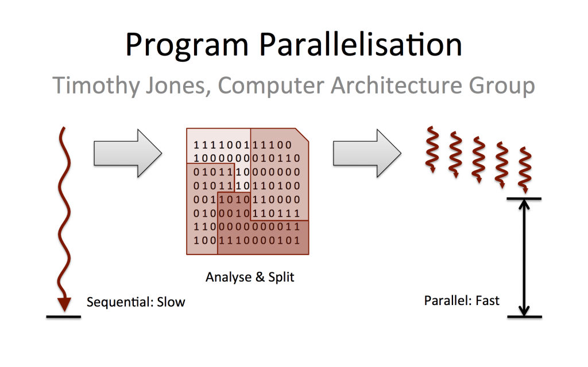

TODO: Update of sequential vs parallel processing

Breaking this down a bit more, there are actually two main ways that parallelism can be used on HPC:
- Running lots of tasks at the same time
- Running a single task using lots of processors or memory

> ## School kids in concert
> Let's use an example from Bernhard Schott, CTO of VCODYNE and formerly project manager on distributed complex systems at Platform Computing. He describes the difference between these approaches in terms of a schoolyard.

> Imagine that we have 200 school kids and you want each of them to pick a piece of paper off the floor. This problem is easy to parallelise, because the task is simple and each kid is independent on what the other kids are doing: Mary doesn't have to wait for John to pick up a piece of paper before she can pickup hers and vice versa.

> Now say you wanted to coordinate those 200 children to perform together in the same ballet. In this case we have a more complex problem, because the actions of one kid are dependent on what else is happening, and the entire groups actions need to be coordinated.

In the first case, we could simulate this problem by using 200 processors or *cores*, each one simulating the actions of one child. In the second case, we would need to use a program that simulates children performing a ballet. For this software to run faster on an HPC system, it would have to be written in way that allows more than one *core* to be used. This is not a trivial task, and not all software is designed like this.

We will look at both types of parallelisation in more detail later.
